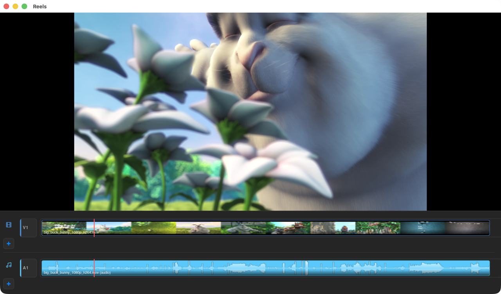
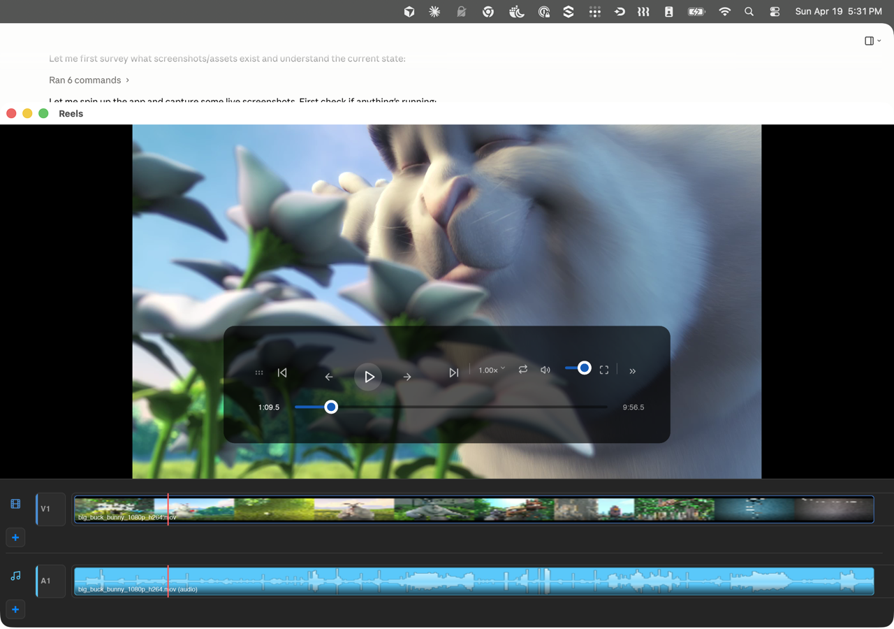
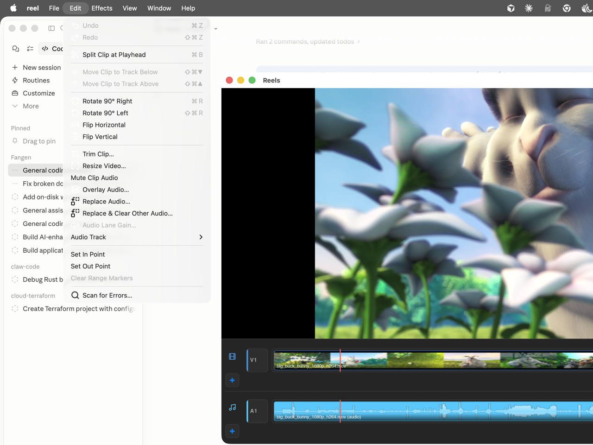
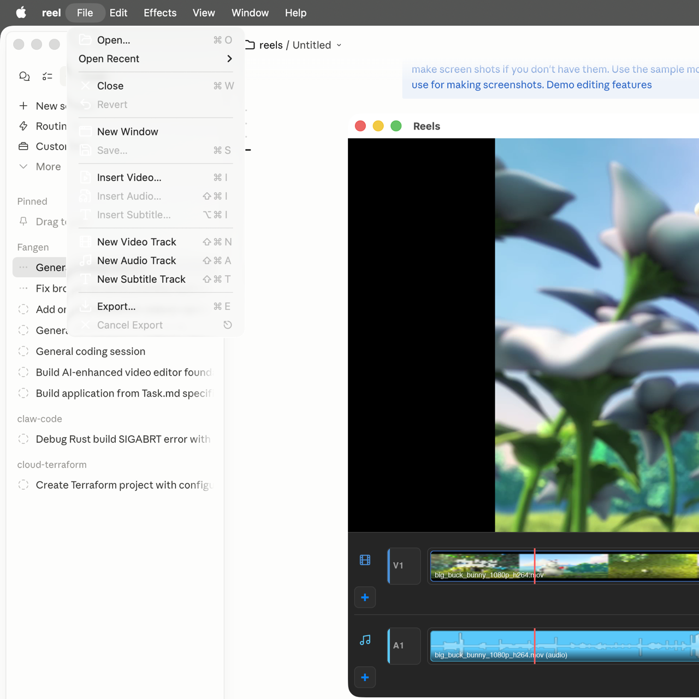
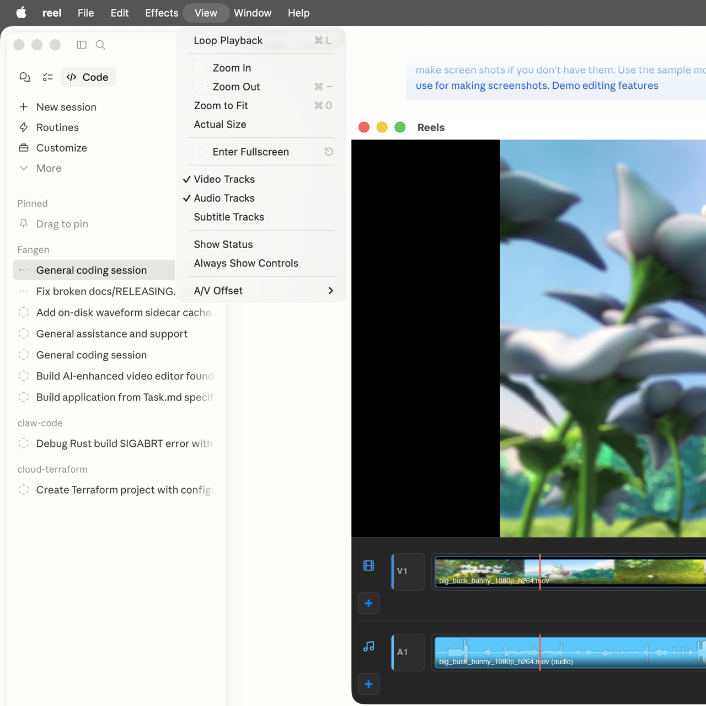
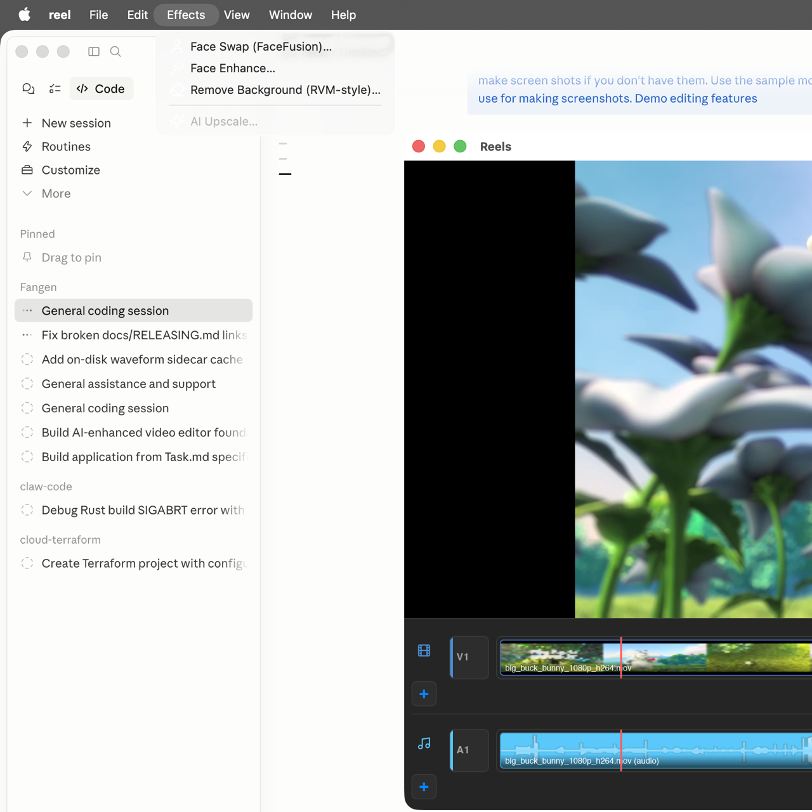
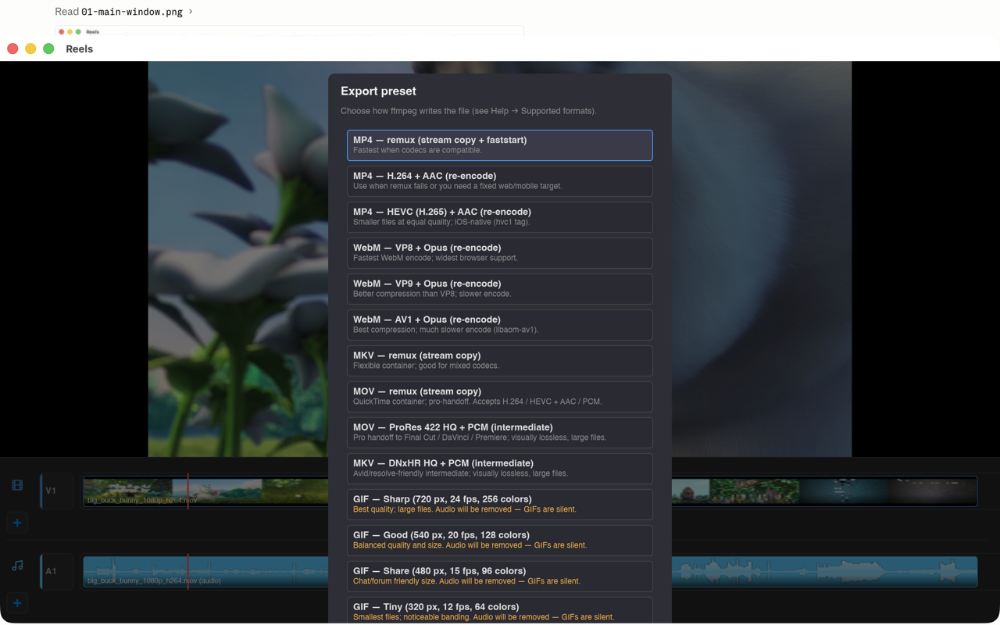
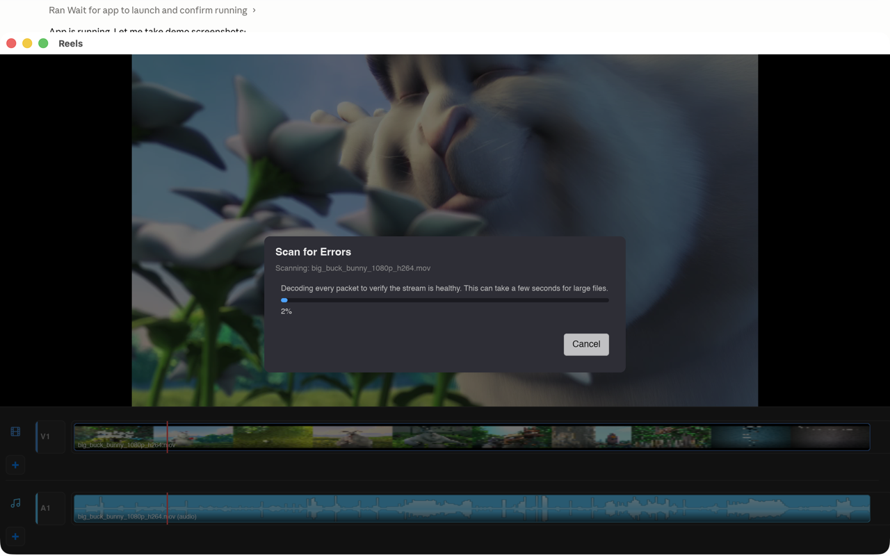
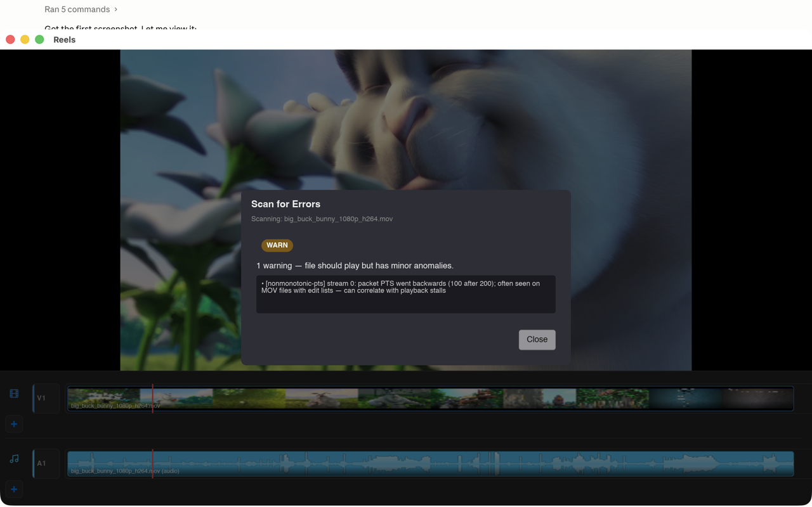

# &nbsp;Reel

**A fully open-source desktop video editor — Rust + Slint + FFmpeg, iMovie-style workflow.**

Reel aims to be a no-strings-attached, source-available video editor that regular people can actually use. The goal is simple: give creators a polished, native editing app without vendoring them into a subscription, locking features behind a paywall, or phoning home. Everything that makes the pixels move — the decoder, the timeline math, the export pipeline, the UI — lives in this repo, under a permissive dual **MIT / Apache-2.0** license.

**Platform roadmap:** macOS first (that's where the dev team and CI live today), then **Linux**, then **Windows**. The core crates are already platform-neutral Rust; the remaining work is packaging, menu integration, and CI runners for each target.



---

## At a glance

- **Native desktop app** written in **Rust** with a **Slint** UI — no Electron, no web view, no bundled Chrome.
- **FFmpeg 7.x** under the hood (via `ffmpeg-next`) for decode, export, and integrity checks.
- **Project format is JSON** (`.reel`) — human-readable, diffable, future-proof.
- **Optional AI sidecar** (`sidecar/`, Python + `uv`) for face-swap / face-enhance / background-removal via FaceFusion. Entirely opt-in; the editor runs without it.
- **Dual-licensed** MIT OR Apache-2.0 so you can pull it into anything — commercial, personal, or academic.

---

## Features today

What ships in the current build (see [docs/FEATURES.md](docs/FEATURES.md) for the exhaustive list and [docs/phase-status.md](docs/phase-status.md) for the engineering roadmap):

### Import & playback
- Open any format FFmpeg 7 can demux — MP4, MOV, MKV, WebM, and more (see [docs/SUPPORTED_FORMATS.md](docs/SUPPORTED_FORMATS.md)).
- Floating transport bar with play / pause, rewind, fast-forward at stepped speeds (0.25× – 2× each direction), scrub slider, volume, loop, A/V offset calibration, fullscreen, and tools. Auto-hides when idle.
- Keyboard shortcuts throughout — see **Help → Keyboard shortcuts** or [docs/KEYBOARD.md](docs/KEYBOARD.md).



### Editing (Edit menu)

- **Undo / Redo** at the document level.
- **Split clip at playhead** (`⌘B`).
- **Move clip** between video tracks (up/down), **Rotate** 90° left/right, **Flip** horizontal/vertical.
- **Trim clip** and **Resize video** in dedicated sheets with preset buttons.
- **Mute clip audio**, **Overlay / Replace audio**, **Audio lane gain**, **Audio track picker** (pick which embedded audio stream plays for a clip).
- **Range markers** (`I` / `O` / `⌥X`) — scope exports to a selection.
- **Scan for Errors…** — runs a full decode pass over the source file and reports demux / decode issues with a PASS / WARN / FAIL verdict (see below).



### File menu

- **Open**, **Open Recent**, **Save** / **Revert**, **New Window**.
- **Insert Video / Audio / Subtitle** onto the current project.
- **New Video / Audio / Subtitle Track**.
- **Export** to the format catalog (see Export below).



### View menu

- **Loop Playback**, **Zoom In / Out / To Fit / Actual Size** (with **pan-when-zoomed**: drag the preview when the image overflows the viewport).
- **Fullscreen** (also on the transport bar).
- Toggle **Video Tracks / Audio Tracks / Subtitle Tracks** visibility.
- **Show Status** footer, **Always Show Controls**, **A/V Offset** submenu for sync calibration.



### Effects menu (optional, via Python sidecar)

- **Face Swap** (FaceFusion)
- **Face Enhance**
- **Remove Background** (RVM-style)
- **AI Upscale** — planned

Effects run out-of-process via `uv run python sidecar/facefusion_bridge.py`. No proprietary SaaS, no API keys. The sidecar venv is managed by `make setup`.



### Export

Ten+ format presets covering the web, mobile, and pro-intermediate tiers plus a range of GIF variants — MP4 (remux, H.264+AAC, HEVC+AAC), WebM (VP8 / VP9 / AV1 + Opus), MKV remux, MOV (remux, ProRes 422 HQ + PCM), MKV DNxHR HQ + PCM, and GIFs sized from *Sharp* down to *Tiny*. See [docs/SUPPORTED_FORMATS.md](docs/SUPPORTED_FORMATS.md).



Multi-audio-lane export mixes every `TrackKind::Audio` lane via `amix`. Partial-clip mutes emit silence substitution automatically.

### Scan for Errors

New in 0.1.3 — quickly answer "is this file damaged, or is the player buggy?" without dropping to the terminal. Decodes every packet in the primary clip's source, tallies demux / decode issues, flags non-monotonic packet PTS (the pattern that correlates with mid-playback stalls on some mobile MOV files), and recommends `ffmpeg -c copy` repair when needed.




---

## Install

### macOS (current tier-1 platform)

**From a release zip** — grab the latest `Reel.app.zip` from [GitHub Releases](https://github.com/analogrithems/reels/releases):

```sh
# macOS Gatekeeper will refuse first launch because our builds aren't
# yet signed + notarized by an Apple Developer account. Strip the
# quarantine xattr once and the app opens normally thereafter.
xattr -d com.apple.quarantine /path/to/Reel.app

# On older macOS where `xattr` lacks `-r`, use find + xargs:
find /path/to/Reel.app -print0 | xargs -0 xattr -d com.apple.quarantine 2>/dev/null
```

You'll also need **FFmpeg 7.x** installed separately (not bundled):

```sh
brew install ffmpeg@7
```

Signed + notarized releases are tracked under **Phase 4** in [docs/phase-status.md](docs/phase-status.md).

### Linux / Windows

Not yet shipped as release artifacts. The core crates already compile on both — see the [Developer section](#developer-section) to build from source. CI runners and packaging for these platforms are planned.

---

## Developer section

### Prerequisites (macOS)

```sh
brew install rustup-init ffmpeg@7 pkg-config uv
rustup-init -y
```

**Why `ffmpeg@7` specifically:** `ffmpeg-next 7.1` binds against FFmpeg 7.x headers; Homebrew's default `ffmpeg` is 8.x and won't compile.

### Make targets

The `Makefile` is the canonical task runner — every target runs with the correct `PKG_CONFIG_PATH` for `ffmpeg@7`, so you don't have to remember it.

| Target | What it does |
|---|---|
| `make setup` | Verify toolchain (`rustup`, `pkg-config`, `uv`, `ffmpeg@7`), `cargo fetch`, and `uv sync` the sidecar venv. Run this once after cloning. |
| `make build` | `cargo build --workspace`. |
| `make test` | `cargo test --workspace --all-features` + `pytest` on the sidecar. |
| `make lint` | `cargo fmt --check` + `cargo clippy -D warnings` + `ruff check` on the sidecar. |
| `make fmt` | Apply formatter. |
| `make run [ARGS='path/to/file.mp4']` | Launch the Slint desktop app. Session log is written as `reels.session.*.log` next to where you invoked `make`. The optional `ARGS=` opens a file on launch (same as `cargo run -p reel-app -- path/to/file.mp4`). |
| `make run-cli [ARGS='probe file.mp4']` | Launch the headless CLI (`reel-cli`) — see [docs/CLI.md](docs/CLI.md). |
| `make macos-app` / `make macos-app-release` | Build a `.app` bundle with `AppIcon.icns` so Finder / Dock show the real icon. |
| `make fixtures` | Regenerate the tiny test fixtures under `crates/reel-core/tests/fixtures/` (needs local ffmpeg). |
| `make ci` | `lint` + `test` — what GitHub Actions runs. |
| `make clean` | `cargo clean` + blow away the sidecar venv. |

### Repository layout

```
crates/
  reel-core/   Media probe/decode, project model, tracing, shared error types
  reel-app/    Slint desktop binary (`reel`)
  reel-cli/    Headless binary (`reel-cli probe`, `reel-cli swap`)
sidecar/       uv-managed Python sidecar (FaceFusion bridge)
docs/          Everything below + this README
assets/        Icons, bundled test videos
scripts/       Build helpers (macOS .app bundler, fixture generator)
```

### Documentation map

All the long-form docs live under [`docs/`](docs/):

- **[docs/README.md](docs/README.md)** — index of user, developer, and agent docs.
- **[docs/FEATURES.md](docs/FEATURES.md)** — every shipping feature, in detail.
- **[docs/architecture.md](docs/architecture.md)** — how the crates fit together, threading rules, where to add what.
- **[docs/phase-status.md](docs/phase-status.md)** — engineering phases (0 – 4) and what's done / in-progress / next.
- **[docs/phases-ui.md](docs/phases-ui.md)** — UI roadmap (U1 – U5).
- **[docs/DEVELOPERS.md](docs/DEVELOPERS.md)** — human contributor onboarding.
- **[docs/AGENTS.md](docs/AGENTS.md)** — Cursor / Claude onboarding (how the repo is structured for AI-assisted contributions).
- **[docs/CONTRIBUTING.md](docs/CONTRIBUTING.md)** — the workflow contract (branches, commits, which docs to update when).
- **[docs/KEYBOARD.md](docs/KEYBOARD.md)** — shortcut reference (also bundled under **Help** in the app).
- **[docs/SUPPORTED_FORMATS.md](docs/SUPPORTED_FORMATS.md)** / **[docs/MEDIA_FORMATS.md](docs/MEDIA_FORMATS.md)** — what the probe + export pipelines support.
- **[docs/CLI.md](docs/CLI.md)** — `reel-cli` subcommands and flags.
- **[docs/RELEASING.md](docs/RELEASING.md)** — tag + push workflow for maintainers.
- **[CHANGELOG.md](CHANGELOG.md)** — per-release notes.

The app itself bundles most of these under the **Help** menu.

### Design choices (the why)

A few deliberate decisions worth surfacing up front:

- **Rust + Slint over Electron / Tauri.** We want a single native binary with predictable memory use and no web renderer in the loop. Slint is Rust-first, has a small runtime, and compiles to real platform widgets where it can.
- **FFmpeg via `ffmpeg-next`, not shelling out.** Decode, export, and scan all go through the in-process bindings. Shelling out to `ffmpeg` for export would be easier short-term but makes progress reporting, cancellation, and error classification painful.
- **Workspace with three crates.** `reel-core` has no UI dependencies so it's trivially unit-testable and usable from the CLI; `reel-app` holds everything Slint-shaped; `reel-cli` is a thin wrapper over `reel-core`. Shared types live in `reel-core`, never in `reel-app`.
- **JSON projects (`.reel`).** Human-readable, diff-friendly, trivially versionable. The serde model is the source of truth — round-tripping through the file format is part of CI.
- **AI is opt-in and out-of-process.** FaceFusion etc. run in the Python sidecar over a stdio bridge. The desktop app never links Python, never bundles a model, and still works if the sidecar is absent.
- **Progress / cancellation via `Arc<AtomicBool>` + `on_ui` bridge.** Long-running work (export, scan, waveform generation) always runs on a worker thread and marshals back to the UI thread via a small helper (`crates/reel-app/src/ui_bridge.rs`). New features should follow the same pattern.
- **Tests include golden UI snapshots.** The Slint window is rendered headlessly in `reel-app`'s test suite — regressions in layout are caught in `cargo test`.
- **Release artifacts are currently unsigned.** We document the one-line `xattr` workaround in this README rather than adding a dependency on an Apple Developer account. Real notarization is [Phase 4](docs/phase-status.md).

---

## Contributing

- Please read **[docs/CONTRIBUTING.md](docs/CONTRIBUTING.md)** first — it covers the branch / commit / docs update rules.
- **[docs/DEVELOPERS.md](docs/DEVELOPERS.md)** is the human onboarding guide; **[docs/AGENTS.md](docs/AGENTS.md)** covers AI-assisted contributions.
- When you add or change a feature, update the matching section in **[docs/FEATURES.md](docs/FEATURES.md)** and the relevant bullet in **[docs/phase-status.md](docs/phase-status.md)** in the same PR.
- Bug reports and feature requests are welcome via GitHub Issues. If you've hit a playback problem, **Edit → Scan for Errors…** against the source file gives a great starting diagnostic to paste in.

## License

Dual-licensed under either of

- [MIT License](LICENSE-MIT)
- [Apache License, Version 2.0](LICENSE-APACHE)

at your option. Unless you explicitly state otherwise, any contribution intentionally submitted for inclusion shall be dual-licensed as above, without any additional terms or conditions.
